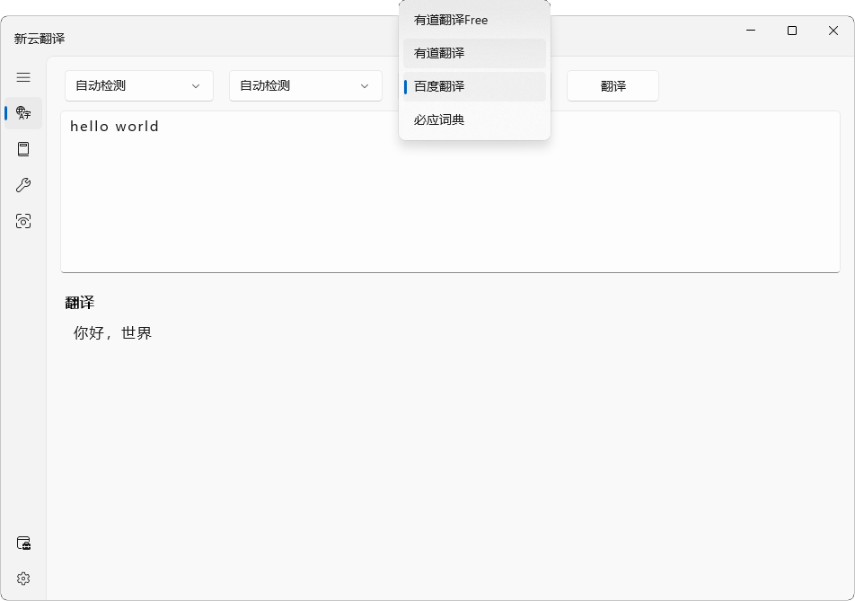
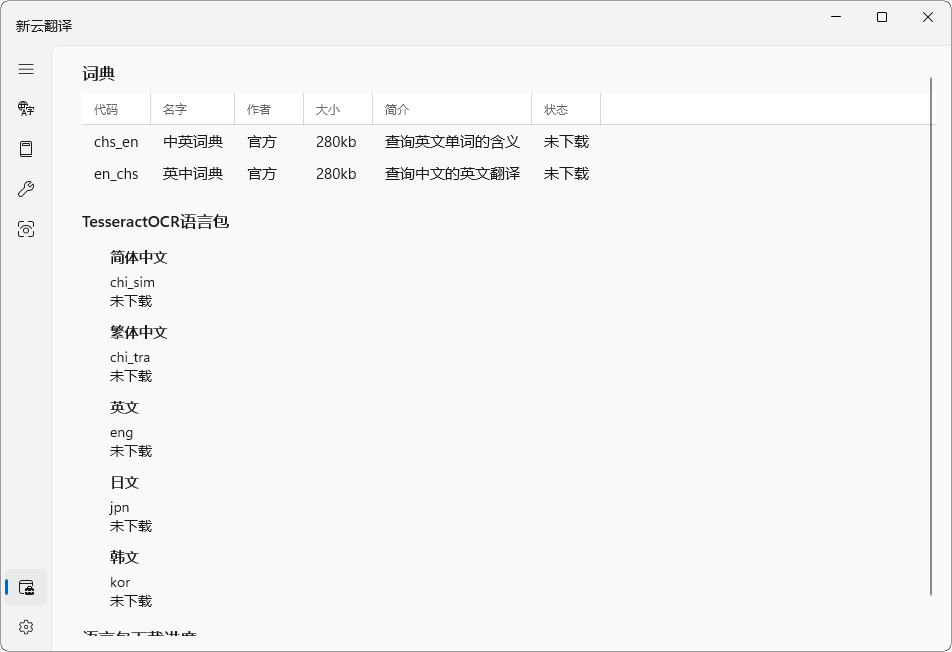

  

<h1 align="center">
  新云翻译
</h1>

  新云翻译5.0使用UWP开发，功能已经基本完成，先前版本有的翻译、词典功能得到保留，另外新增加了OCR识别。

  
  
  
  

## 功能特色
* 漂亮的界面
* 支持**Mica**和**Acrylic**
* 四个翻译引擎
* 词典查询
* 小工具集合
* 四个OCR识别引擎
* ……

## 预计功能

- 收藏单词
- 翻译记录
- 语音输入
- 朗读单词
- ……

## 软件截图

